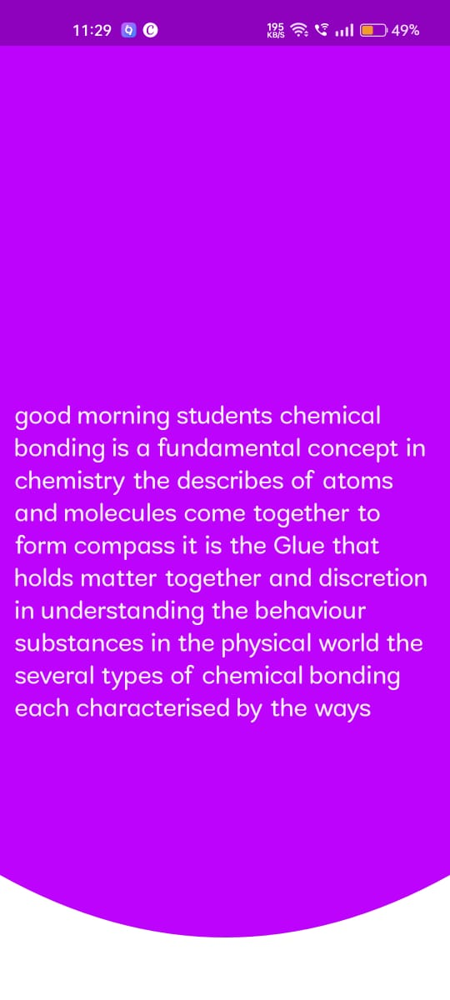

# STUDIESY
<h1 align="center">
   
  
   
  STUDIESY
   
</h1>

<h3 align="center">AI-Powered Education: Bridging the Opportunity Gap</h3>

## About

This project was created for Mobile App Development challenge

## Team Members:

- [Goutham C Arun](https://github.com/GouthamCArun)
- [Alfred Jimmy](https://github.com/alffy007)
- [Athul Babu](https://github.com/ATHULB04)

## PPT presentation of our project can be viewed in the folowing link
"https://www.canva.com/design/DAFvX_bGfOk/8GfmUS96HK8EMLzYBjFO1A/edit?utm_content=DAFvX_bGfOk&utm_campaign=designshare&utm_medium=link2&utm_source=sharebutton"

## Video Presentation of our project can be viewed in the following link
"https://youtu.be/WJzbrlJGpss?si=OkbFdzOP3wU3aN7s"

  
  
  

## For APK click here 👇
"https://drive.google.com/file/d/1tgaNINw4XmQR1X5UGOymutfpHiTmQ7VU/view?usp=sharing"

## The Problem We Solve: "Education Accessibility: Develop inclusive applications that utilize generative AI to make education more accessible to individuals with disabilities, ensuring equal learning opportunities for all."
"In traditional classrooms, a one-size-fits-all approach falls short, particularly for physically challenged students. Our mission at Studiesy is to foster inclusive and empowering learning environments for every student, addressing doubts, offering lesson replays, and providing reliable guidance for a brighter educational future."

## Solution
Our product will have the following features:

### 1. Live Transcription

"Live transcriptions bring magic to every classroom, ensuring inclusivity and accessibility for all students. No one misses out on the learning journey."

### 2.Daily class summaries of the class

"On their way home, students receive neatly summarized class notes, enhancing their learning experience and reinforcing classroom teachings."

### 3. A Chatbot Powered by Your Teacher's Wisdom! 

"Meet your companion chatbot: your teacher's wisdom distilled. Say goodbye to searching for facts in the online sea; trust your ally at your fingertips."

### 4. AudioSmart Summaries

"Imagine a world where students not only read but also hear their daily class summaries. Innovation that empowers the visually impaired and those who benefit from repeated listening. It's knowledge harmonized for all, transforming the classroom experience."

### 5. Teacher's Record: Unleash the Magic!

"Teachers hit record, and the magic unfolds! Live transcriptions, summarized notes, and audio options make learning incredible. A helpful chatbot ensures accurate answers to your questions."

### Railway for Hosting
Furthermore, for hosting our project, we chose Railway. Railway is a cloud platform that simplifies the deployment and management of web applications. By utilizing Railway for hosting, we were able to easily deploy our project and make it accessible to users over the internet. Railway's user-friendly interface and seamless setup process allowed us to integrate our project with their platform effortlessly. With Railway, we benefit from reliable hosting infrastructure and automatic scaling, ensuring that our application can handle incoming traffic effectively. 

 <h3>This is How it works</h3>
      
   

      

    
     
   <h3>In Detail</h3>
      
    

      

    
     
   

# TECH STACKS USED

<h3> 
  1.Flutter 
   
  2.Large Language Model(LLM) with LangChain
   
 3.FIREBASE as Database, storge
   
 4.Flask Rest API (Backend framework)
   
 5.RAILWAY(backend hosting)
   
 6.Python (for various conversion)
   
  
</h3>

